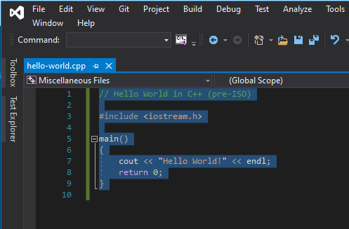
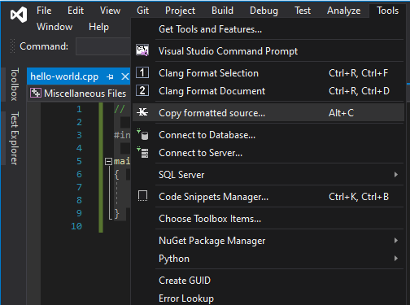

# CopyFormattedSource
A Visual Studio extension which copies a section of text from the selected active document and wraps it in backticks (*``*) for Markdown use.

# Extra Formatting
By default, the following formatting rules are applied -
- the entire selection is wrapped in backticks;
- a language name is pulled from the file extension of the active document;
- the active document path and line selection number is included as the first line of the source snippet;
- any empty lines at the start or end of the selection are trimmed;
- minimum indentation is applied to the entire selection.

# Example
First, highlight the text you intend to copy from the active window.



Then, go to `Tools`->`Copy Formatted Source...`.



The formatted source selection will then be copied into the clipboard. Paste the selection into a markdown file to preview the selection. For example, the selection above will yield the following snippet.

```
```c++
/* D:\temp\hello-world.cpp(1) */
// Hello World in C++ (pre-ISO)

#include <iostream.h>

main()
{
    cout << "Hello World!" << endl;
    return 0;
}
```
